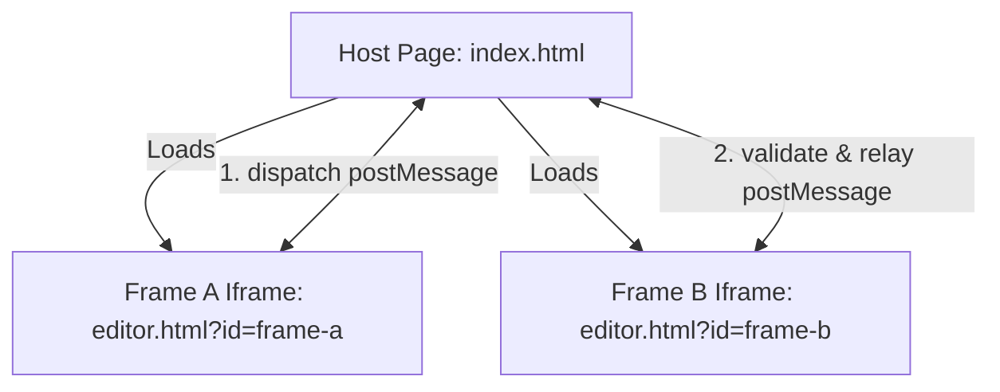
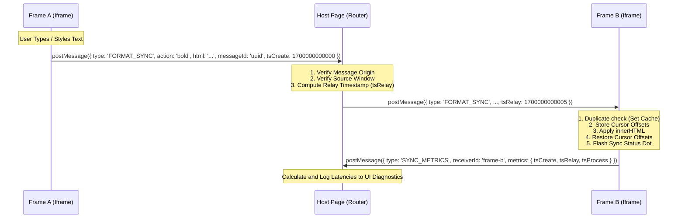

# SyncWrite

SyncWrite is a high-performance, split-pane rich text editor workspace designed to demonstrate secure, low-latency, bidirectional document synchronization between sandboxed iframe elements using the HTML5 `postMessage` API.

---

## Architecture Diagram

SyncWrite splits operations between a stateless orchestration layer (Host Page) and independent rendering contexts (Nested Editor Iframes) to maintain strict document sandboxing.



---

## Features

- **Bidirectional Sync**: Real-time synchronization of formatting commands (Bold, Italic, Strikethrough) and raw text input changes.
- **Diagnostics Panel**: Real-time logging of transactions reporting sender-to-host and host-to-receiver performance.
- **Sync Statistics**: Live statistics feed measuring total sent/received messages, source frame distributions, and running average sync latency.
- **Cursor Selection Preservation**: Uses character offsets via Selection and Range APIs to prevent caretaker focus jumps or text selection loss when updates are applied to active editors.
- **Message Deduplication**: Employs cryptographic message IDs to prevent identical payloads from running duplicate cycles.

---

## Message Flow

Every update cycles through three phases: Broadcast, Routing, and Processing.



---

## Design Strategies

### 1. Loop Prevention Strategy
Bidirectional synchronization naturally risks infinite recursion loops (`Frame A -> Host -> Frame B -> Host -> Frame A`). SyncWrite blocks loops using three defensive checks inside `editor.js`:
- **State Lock Flag (`isApplyingRemoteChange`)**: Prior to modifying the DOM with a remote update, the receiver sets `isApplyingRemoteChange = true`. Local mutation listeners (`input`, key listeners) check this lock and immediately return if active. The lock is released only after the DOM update and selection restoral complete.
- **Content Comparison Guard**: Before mutating the DOM, the editor compares incoming HTML against `editor.innerHTML`. If they are identical, the update is discarded.
- **Local Content Caching (`lastContent`)**: Keeps track of the last-known broadcasted/received content, discarding duplicate outbound payloads.

### 2. Debouncing Strategy
To optimize performance and prevent message flooding over standard keystrokes:
- **Throttled Typing**: Keyboard events (`input`) are debounced by **300ms** to package words together.
- **Instant Formatting**: Formatting commands (Bold, Italic, Strikethrough clicks) bypass the debounce queue and dispatch instantly to maximize responsiveness.
- **Race Condition Guard**: Clicking a formatting button instantly clears any active typing debounce timer (`clearTimeout(debounceTimeoutId)`) to ensure the preceding text updates sync in chronological order.

### 3. Cursor & Selection Preservation
Setting `innerHTML` directly destroys all existing DOM text nodes, rendering standard Range node references useless. 
- **Method**: The Selection and Range APIs are used to measure the caret position as a numeric character offset relative to the editor text length (computed via Range cloning and `.toString().length`).
- **Restoration**: Upon applying changes, the editor traverses text nodes using a depth-first search (DFS) stack structure to map those numeric character counts back to the newly created text nodes and restores selection boundaries safely.

---

## Security Measures

- **Origin Whitelisting**: `host.js` matches `event.origin` against `window.location.origin` (including `null` to accommodate local filesystem `file:///` protocols).
- **Source Verification**: Explicitly verifies `event.source` matches the cached references of the two loaded iframes (`frameAWindow` and `frameBWindow`) to ignore events generated by browser extensions or malicious nested scripts.
- **Cryptographic Deduplication**: Messages include a `messageId` generated via `crypto.randomUUID()`. Each frame tracks recently processed message IDs in a temporary `Set` that garbage-collects items after 10 seconds, protecting the app from duplicate processing and replay issues.

---

## How to Run

SyncWrite is written in pure vanilla HTML, CSS, and JS with zero npm compile dependencies.

### Option 1: Live Local Server (Recommended)
Navigate to the root directory and start a local HTTP server:
```bash
# Using Python 3
python -m http.server 8000
```
Open `http://localhost:8000` in your web browser.

### Option 2: Direct Browser Execution
Double-click `index.html` in your file explorer to open it via `file:///` protocol. The built-in origin validation logic accommodates local testing automatically.

---

## Folder Structure

```
SyncWrite/
├── index.html                 # Host Dashboard Interface
├── index.css                  # Core layout styles
├── host.js                    # Message router & metrics logger
├── README.md                  # System Documentation
└── editor/
    ├── editor.html            # Editor iframe template
    ├── editor.css             # Editor layout & status styles
    └── editor.js              # State synchronizer & caret controller
```

---

## Screenshots Section

For a visual demonstration of the system:
- **Host Dashboard UI**: Dark mode split-pane layout featuring Frame A and Frame B side-by-side.
- **Diagnostics Panel**: The logs footer displays latency metrics showing segment transit speeds (e.g. `Frame A -> Host : 2ms | Host -> Frame B : 1ms | Total Sync Time : 3ms`).
- **Statistics Panel**: Displays total transaction volume and running average latencies in real-time.

---

## Future Improvements

1. **Conflict-Free Replicated Data Types (CRDTs) or Operational Transformation (OT)**: Move from crude HTML replacements to operation-based patching (e.g., Yjs or Automerge) to handle simultaneous typing conflicts.
2. **Secure Origin Configuration**: In a production environment, restrict target origins (`postMessage(payload, targetOrigin)`) to explicit domains instead of utilizing wildcard (`*`) fallbacks.
3. **Selective HTML Sanitization**: Introduce DOMPurify inside the editors to sanitize incoming HTML content before inserting it into the DOM, mitigating potential cross-site scripting (XSS) issues.
